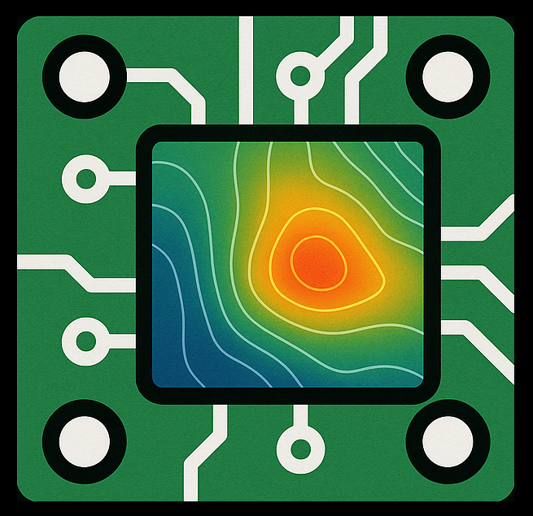

<!-- PROJECT LOGO -->
<br />
<p align="center">
  <a href="https://github.com/UTN-BA-Sats/thermal_analysis_testboard">
    
  </a>

  <h3 align="center">Thermal Analysis Test-PCB</h3>

  <p align="center">
    Pequeño repositorio para realizar ensayos térmicos en circuitos impresos
    <br />
    <br />
    <br />
    <a href="https://github.com/UTN-BA-Sats/thermal_analysis_testboard">View Demo</a>
    ·
    <a href="https://github.com/UTN-BA-Sats/thermal_analysis_testboard/issues">Report Bug</a>
    ·
    <a href="https://github.com/UTN-BA-Sats/thermal_analysis_testboard/issues">Request Feature</a>
  </p>
</p>


<!-- ABOUT THE PROJECT -->
## About The Project

[![Product Name Screen Shot][product-screenshot]](https://example.com)


<!-- GETTING STARTED -->
## Getting Started

To get a local copy up and running follow these simple steps.

### Prerequisites

- Altium Designer

### Installation

1. Clone the repo
   ```sh
   git clone https://github.com/UTN-BA-Sats/thermal_analysis_testboard.git
   ```


<!-- CONTRIBUTING -->
## Contributing

Contributions are what make the open source community such an amazing place to be learn, inspire, and create. Any contributions you make are **greatly appreciated**.

1. Fork the Project
2. Create your Feature Branch (`git checkout -b feature/AmazingFeature`)
3. Commit your Changes (`git commit -m 'Add some AmazingFeature'`)
4. Push to the Branch (`git push origin feature/AmazingFeature`)
5. Open a Pull Request


<!-- LICENSE -->
## License

Distributed under the MIT License. See `LICENSE` for more information.


<!-- CONTACT -->
## Contact

Lucas Liaño - lliano@frba.utn.edu.ar

Project Link: [https://github.com/UTN-BA-Sats/thermal_analysis_testboard](https://github.com/UTN-BA-Sats/thermal_analysis_testboard)


<!-- MARKDOWN LINKS & IMAGES -->
<!-- https://www.markdownguide.org/basic-syntax/#reference-style-links -->
[product-screenshot]: images/screenshot.png
